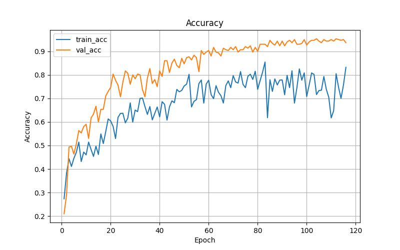
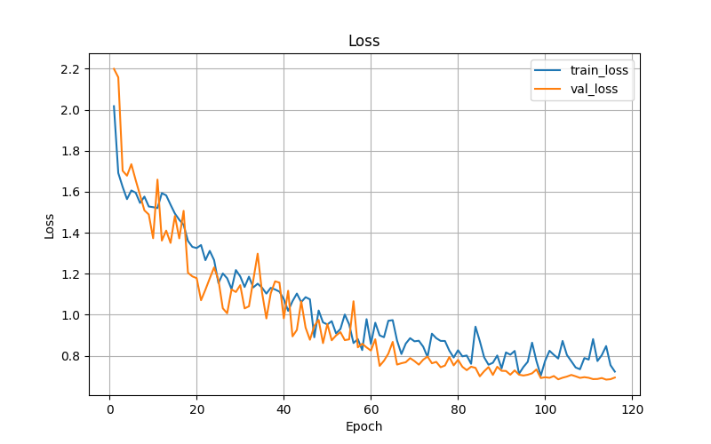
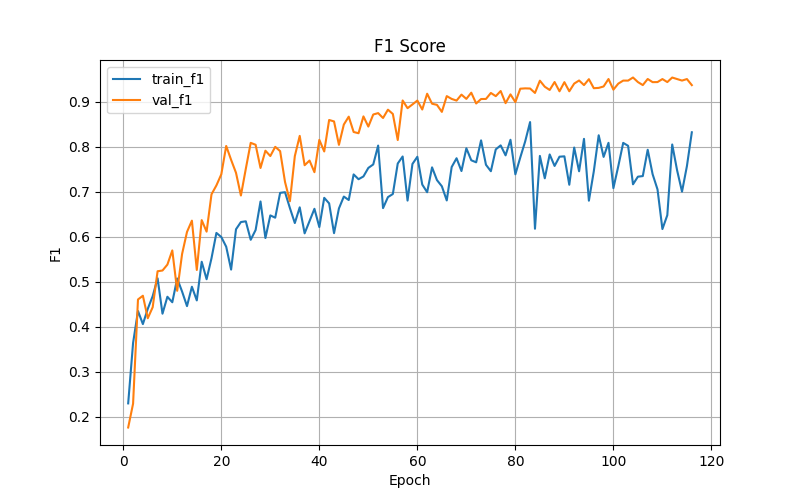
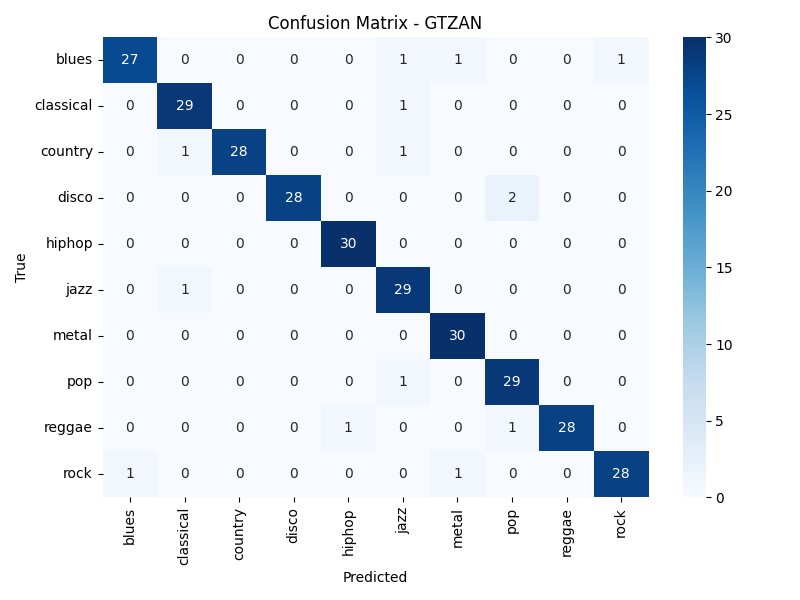

# Music Genre Classification on GTZAN

This project implements a deep learning system for automatic music genre
classification using the GTZAN dataset.

## Architecture
- CNN-based spectral feature extraction
- Temporal modeling using BiLSTM and Transformer
- Attention-based pooling

## Results

### Accuracy Curve


### Loss Curve


### F1 Score


### Confusion Matrix


**Performance Summary**
- Validation Accuracy: ~95%
- Macro F1-score: ~0.94


## Training
```bash
python src/train.py
